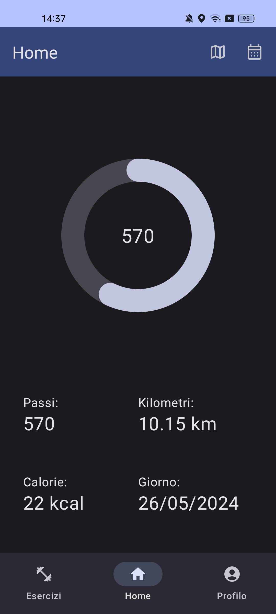
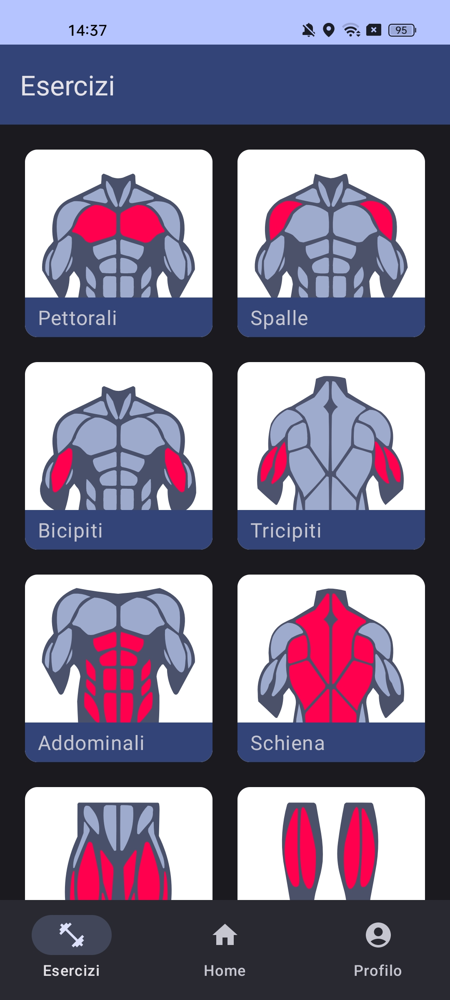
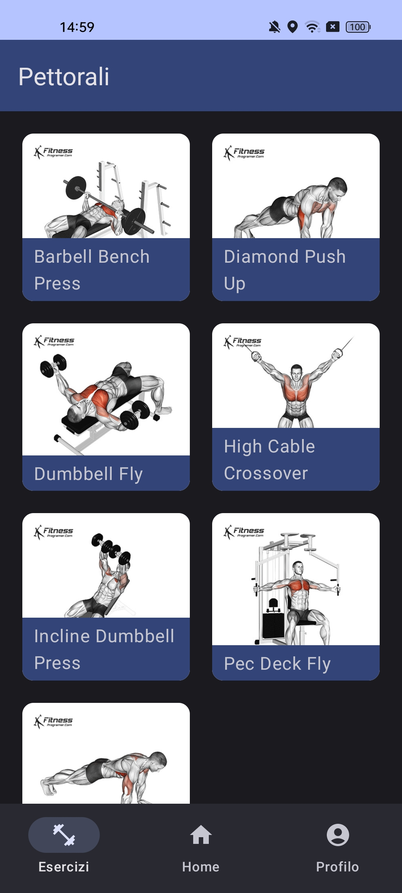
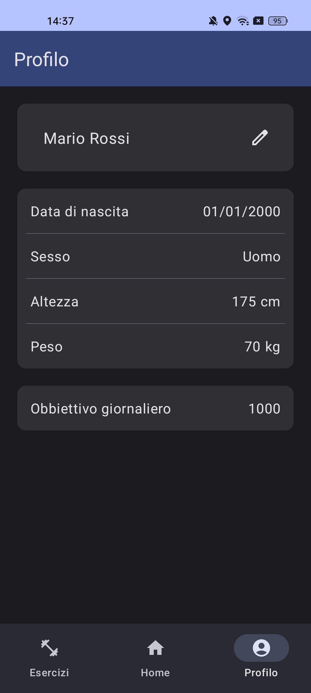

# FitnessApp
## Descrizione
L'applicazione consiste in una semplice app di fitness, dove le funzioni principali sono quelle di monitoraggio dell'attività fisica dell'utente, tracciamento del persorco svolto durante il giorno e visualizzazione di alcuni esercizi fisici.
## Strumenti
- Jetpack Compose
- Room Database
- Sensori di activity recognition e location
- Google Maps
## Funzioni
- Contapassi
- Calcolo delle calorie bruciate
- Calcolo dei kilometri persorsi
- Visualizzazione del persorso fatto
- Visualizzazione di esercizi divisi per gruppi muscolari
- Personalizzazione dei dati dell'utente
- Personalizzazione dell'obiettivo di passi
- Invio di una notifica al raggiungimento dell'obiettivo di passi
## Screen

