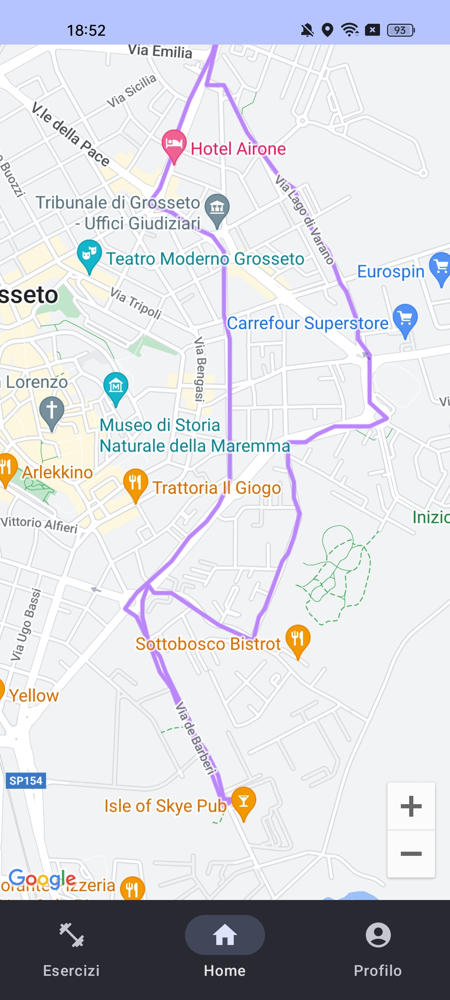

# FitnessApp
## Descrizione
L'applicazione consiste in una semplice app di fitness, dove le funzioni principali sono quelle di monitoraggio dell'attività fisica dell'utente, tracciamento del persorco svolto durante il giorno e visualizzazione di alcuni esercizi fisici.
## Strumenti
- Jetpack Compose
- Room Database
- Sensore Step Counter
- Geolocazione
- Google Maps
## Funzioni
- Contapassi
- Calcolo delle calorie bruciate
- Calcolo dei kilometri persorsi
- Visualizzazione del persorso fatto durante il giorno
- Visualizzazione di esercizi fisici divisi per gruppi muscolari
- Personalizzazione dei dati dell'utente
- Personalizzazione dell'obiettivo di passi giornaliero
- Invio di una notifica al raggiungimento dell'obiettivo dei passi
## Componenti
Le componenti principali dell'applicazione sono 3:
- Activity Main
- Step Counter Service
- Location Service

All'interno dell'activity è possibile navigare tra le varie sezioni dell'app attraverso un insieme di componenti di Jetpack Compose (NavController, NavHost, ecc.) che offrono un servizio di routing tra le varie schermate. Una delle schermate principali dell'applicazione è quella della mappa, dove vengono riportati gli spostamenti dell'utente durante la giornata, creata utilizzando il servizio di Google Play Services dedicato alla visualizzazione delle mappe in android.

I service dell'app sono tutti e due foreground service, per permettere un continuo monitoraggio dell'attività dell'utente, anche con l'applicazione chiusa. Per il servizio di contapassi si sfrutta il sensore *step counter* che provvede autonomamente al conteggio dei passi, invece per la geolocazione è stato utilizzato il *fused location provider*, dove si richiedono i dati aggioranti con un rate costante (ogni secondo).
## Screen

